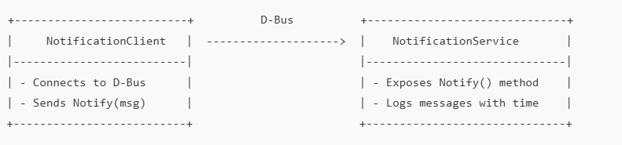

# Smart-Notification-via-D-Bus
Smart Notification via D-Bus (C++)

# Components:
## NotificationService (server):

- Exposes a D-Bus interface.

- Accepts string messages.

- Logs received messages with timestamps to console or file.

## NotificationClient (client):

- Connects to the D-Bus.

- Sends a message to the NotificationService using the defined D-Bus method.

# D-Bus Details:

Property	Value
--------------------------------------------
Bus Type	SESSION bus
Service Name	org.example.NotificationService
Object Path	/org/example/Notification
Interface	org.example.Notification
Method	Notify(string message)

## ARCHITECTURE DIAGRAM



## TOOLS & DEPENDENCIES
- OS: Any Linux distro with D-Bus

- Language: `C++`

- Libraries:
    - libdbus-1 (`sudo apt install libdbus-1-dev`)

- Build Tool: `g++`, `Make`

## INTERFACE DEFINITION (.xml)
Create notification.xml:

```xml
<!DOCTYPE node PUBLIC "-//freedesktop//DTD D-BUS Object Introspection 1.0//EN"
 "http://www.freedesktop.org/standards/dbus/1.0/introspect.dtd">
<node>
  <interface name="org.example.Notification">
    <method name="Notify">
      <arg type="s" name="message" direction="in"/>
    </method>
  </interface>
</node>
```
